# MCP MIDI TOOL クラス図

Version: 1.0  
Date: 2025-08-28  
Status: Production Ready  

## 全体アーキテクチャ

```mermaid
classDiagram
    %% MCP Server Core
    class MCPServer {
        +handleRequest(request: MCPRequest): MCPResponse
        +listTools(): Tool[]
        +callTool(name: string, args: any): any
        -tools: Map~string, ToolHandler~
    }
    
    %% Storage Layer
    class StorageService {
        +resolveBaseDir(): string
        +resolveMidiDir(): string  
        +resolveManifestPath(): string
        +ensureDir(dir: string): Promise~void~
        +readManifest(): Promise~Manifest~
        +writeManifest(manifest: Manifest): Promise~void~
        +appendItem(item: MidiItem): Promise~void~
        +getItemById(fileId: string): Promise~MidiItem~
    }
    
    class Manifest {
        +items: MidiItem[]
    }
    
    class MidiItem {
        +id: string
        +name: string
        +path: string
        +bytes: number
        +createdAt: string
    }
    
    %% MIDI File Processing
    class JsonToSmfService {
        +convertToSmf(json: JsonMidi, format: string): SMFResult
        +validateJsonMidi(json: any): ValidationResult
        +encodeToSmfBinary(jsonMidi: JsonMidi): Buffer
        -createTrackChunk(events: MidiEvent[]): Buffer
        -writeVariableLength(value: number): Buffer
    }
    
    class SmfToJsonService {
        +convertToJson(smfData: Buffer): JsonResult
        +extractMetadata(smf: any): MetaInfo
        +decodeEvents(track: any): MidiEvent[]
        -parseTempoChanges(events: any[]): TempoEvent[]
        -parseTimeSignature(events: any[]): TimeSigEvent[]
    }
    
    class ScoreCompiler {
        +compileScoreDsl(scoreDsl: ScoreDSL): JsonMidi
        +validateScore(score: any): ValidationResult
        +processAutoCcPresets(score: ScoreDSL): MidiEvent[]
        -compilePosition(pos: Position, timeSig: TimeSignature, ppq: number): number
        -compileDuration(dur: DurationSpec, ppq: number): number
        -applyPreset(preset: AutoCcPreset, events: MidiEvent[]): MidiEvent[]
    }
    
    %% MIDI Data Models
    class JsonMidi {
        +ppq: number
        +tracks: JsonTrack[]
        +meta?: MetaEvents
        +validate(): boolean
    }
    
    class JsonTrack {
        +channel?: number
        +events: MidiEvent[]
        +name?: string
    }
    
    class MidiEvent {
        +tick: number
        +type: string
        +channel?: number
        +pitch?: number
        +velocity?: number
        +duration?: number
        +controller?: number
        +value?: number
        +program?: number
        +bend?: number
    }
    
    %% Score DSL Models
    class ScoreDSL {
        +ppq?: number
        +meta: ScoreMeta
        +tracks: ScoreTrack[]
        +validate(): boolean
    }
    
    class ScoreMeta {
        +timeSignature: TimeSignature
        +keySignature: KeySignature  
        +tempo: TempoSpec
        +title?: string
        +composer?: string
        +autoCcPresets?: AutoCcPreset[]
    }
    
    class ScoreTrack {
        +name?: string
        +channel?: number
        +program?: number
        +events: ScoreEvent[]
    }
    
    class ScoreEvent {
        +type: string
        +note?: string
        +pitch?: number
        +start: Position
        +duration: DurationSpec
        +velocity?: number
        +dynamic?: string
        +tie?: boolean
        +slur?: boolean  
        +articulation?: string
    }
    
    class Position {
        +bar: number
        +beat: number
        +unit?: number
        +offset?: number
        +toTick(ppq: number, timeSig: TimeSignature): number
    }
    
    class DurationSpec {
        +value: string
        +dots?: number
        +tuplet?: TupletSpec
        +toTicks(ppq: number): number
    }
    
    class TupletSpec {
        +inSpaceOf: number
        +play: number
    }
    
    %% Playback System
    class PlaybackManager {
        +startPlayback(fileId: string, config: PlaybackConfig): PlaybackSession
        +stopPlayback(playbackId: string): void
        +getStatus(playbackId: string): PlaybackStatus
        -sessions: Map~string, PlaybackSession~
    }
    
    class PlaybackSession {
        +playbackId: string
        +fileId: string
        +status: string
        +startedAt: number
        +scheduledEvents: ScheduledEvent[]
        +config: PlaybackConfig
        +cursor: number
        +lastSentAt?: number
        +start(): void
        +stop(): void
        +updateCursor(tick: number): void
    }
    
    class MidiScheduler {
        +schedule(events: MidiEvent[], config: PlaybackConfig): ScheduledEvent[]
        +startScheduling(session: PlaybackSession): void
        +stopScheduling(sessionId: string): void
        -timers: Map~string, NodeJS.Timeout~
        -noteOffQueue: Map~string, NoteOffEvent[]~
        -sendMidiMessage(message: number[], portName: string): void
    }
    
    class ScheduledEvent {
        +tick: number
        +absoluteMs: number
        +midiMessage: number[]
        +eventType: string
    }
    
    %% Recording System
    class ContinuousRecordingManager {
        +startRecording(config: RecordingConfig): ContinuousRecordingSession
        +getStatus(recordingId: string): RecordingStatus
        +stopRecording(recordingId: string, name?: string): SavedFile
        +listRecordings(filter: ListFilter): RecordingList
        -registry: Map~string, ContinuousRecordingSession~
        -cleanupOldSessions(): void
        -saveContinuousRecordingAsSmf(session: ContinuousRecordingSession): SavedFile
    }
    
    class ContinuousRecordingSession {
        +id: string
        +startedAt: number
        +firstInputAt?: number
        +lastInputAt?: number
        +status: string
        +reason?: string
        +ppq: number
        +maxDurationMs: number
        +idleTimeoutMs: number
        +silenceTimeoutMs: number
        +channelFilter?: number[]
        +eventTypeFilter: string[]
        +inputInstance?: any
        +inputPortName?: string
        +events: MidiEvent[]
        +timers: TimeoutTimers
        +addEvent(event: MidiEvent): void
        +finalize(reason: string): void
    }
    
    class SingleCaptureManager {
        +startCapture(config: CaptureConfig): SingleCaptureSession  
        +feedEvents(captureId: string, events: FeedEvent[]): FeedResult
        +getStatus(captureId: string): CaptureStatus
        +startDeviceCapture(config: DeviceCaptureConfig): SingleCaptureSession
        -registry: Map~string, SingleCaptureSession~
    }
    
    class SingleCaptureSession {
        +id: string
        +startedAt: number
        +onsetWindowMs: number
        +silenceMs: number
        +maxWaitMs: number
        +notes: Map~number, NoteInfo~
        +done: boolean
        +result?: CaptureResult
        +reason?: string
        +inputInstance?: any
        +inputPortName?: string
        +originMs?: number
        +lastEventAt?: number
        +addNote(note: number, velocity: number, at: number): void
        +releaseNote(note: number, at: number): void
        +checkCompletion(): void
    }
    
    class NoteInfo {
        +onAt: number
        +velocity: number
        +offAt?: number
    }
    
    %% Device Management
    class DeviceManager {
        +listInputDevices(): DeviceInfo[]
        +listOutputDevices(): DeviceInfo[]
        +openInputDevice(portName?: string): MidiInputDevice
        +openOutputDevice(portName?: string): MidiOutputDevice
        -loadMidi(): Promise~void~
    }
    
    class MidiInputDevice {
        +portName: string
        +portIndex: number
        +instance: any
        +on(event: string, handler: Function): void
        +openPort(index: number): void
        +closePort(): void
    }
    
    class MidiOutputDevice {  
        +portName: string
        +portIndex: number
        +instance: any
        +sendMessage(message: number[]): void
        +openPort(index: number): void
        +closePort(): void
    }
    
    class DeviceInfo {
        +index: number
        +name: string
    }
    
    %% Utility Services
    class TimeManager {
        +msToTick(relativeMs: number, ppq: number): number
        +tickToMs(tick: number, ppq: number): number
        +calculateDuration(startTick: number, endTick: number, ppq: number): number
        -usPerQuarter: number
    }
    
    class EventProcessor {
        +processEvents(events: MidiEvent[], filters: EventFilter[]): MidiEvent[]
        +applyChannelFilter(events: MidiEvent[], channels: number[]): MidiEvent[]
        +applyEventTypeFilter(events: MidiEvent[], types: string[]): MidiEvent[]
        +validateEvent(event: MidiEvent): ValidationResult
    }
    
    class ErrorClassifier {
        +classifyError(tool: string, err: any): ErrorInfo
        -detectValidationError(message: string): boolean
        -detectDeviceError(message: string): boolean
        -detectNotFoundError(message: string): boolean
    }
    
    class ValidationService {
        +validateJsonMidi(json: any): ValidationResult
        +validateScoreDsl(score: any): ValidationResult
        +validateMidiEvent(event: any): ValidationResult
        +validateRecordingConfig(config: any): ValidationResult
    }
    
    %% Tool Implementations
    class ToolRegistry {
        +registerTool(name: string, handler: ToolHandler): void
        +getTool(name: string): ToolHandler
        +listTools(): Tool[]
        -tools: Map~string, ToolHandler~
    }
    
    class ToolHandler {
        +handle(args: any): Promise~any~
        +validateArgs(args: any): ValidationResult
        +getInputSchema(): JSONSchema
    }
    
    %% Relationships
    MCPServer --> ToolRegistry
    MCPServer --> StorageService
    MCPServer --> JsonToSmfService
    MCPServer --> SmfToJsonService
    MCPServer --> ScoreCompiler
    MCPServer --> PlaybackManager
    MCPServer --> ContinuousRecordingManager
    MCPServer --> SingleCaptureManager
    MCPServer --> DeviceManager
    
    StorageService --> Manifest
    Manifest --> MidiItem
    
    JsonToSmfService --> JsonMidi
    SmfToJsonService --> JsonMidi
    ScoreCompiler --> ScoreDSL
    ScoreCompiler --> JsonMidi
    
    JsonMidi --> JsonTrack
    JsonTrack --> MidiEvent
    
    ScoreDSL --> ScoreMeta
    ScoreDSL --> ScoreTrack
    ScoreTrack --> ScoreEvent
    ScoreEvent --> Position
    ScoreEvent --> DurationSpec
    DurationSpec --> TupletSpec
    
    PlaybackManager --> PlaybackSession
    PlaybackSession --> MidiScheduler
    MidiScheduler --> ScheduledEvent
    
    ContinuousRecordingManager --> ContinuousRecordingSession
    ContinuousRecordingSession --> MidiEvent
    
    SingleCaptureManager --> SingleCaptureSession
    SingleCaptureSession --> NoteInfo
    
    DeviceManager --> MidiInputDevice
    DeviceManager --> MidiOutputDevice
    DeviceManager --> DeviceInfo
    
    ToolRegistry --> ToolHandler
    
    %% Utility relationships
    EventProcessor --> MidiEvent
    TimeManager --> MidiEvent
    ValidationService --> JsonMidi
    ValidationService --> ScoreDSL
    ErrorClassifier --> MCPServer
```

## 主要クラスの責務

### Core Layer

#### MCPServer
- MCPプロトコル準拠のリクエスト/レスポンス処理
- ツール呼び出しのルーティング
- エラーハンドリングと構造化レスポンス生成

#### StorageService
- ファイルシステム操作の抽象化
- manifest.json管理
- プロセス分離（manifest.{pid}.json）

### Data Processing Layer

#### JsonToSmfService / SmfToJsonService
- JSON MIDI ↔ SMFバイナリの双方向変換
- MIDIイベントのエンコード/デコード
- メタ情報（テンポ・拍子・調号）の処理

#### ScoreCompiler  
- Score DSL → JSON MIDI変換
- 音楽記法の計算（小節/拍 → tick）
- 自動CC付与プリセットの処理

### Session Management Layer

#### PlaybackManager / PlaybackSession
- SMFファイルのリアルタイム再生管理
- 再生状態追跡（cursor, 進捗情報）
- 複数再生セッションの管理

#### ContinuousRecordingManager / ContinuousRecordingSession
- 長時間MIDI記録の管理
- 3種類タイムアウト制御
- 最大3セッション同時制限

#### SingleCaptureManager / SingleCaptureSession
- 単発和音/単音キャプチャ
- onset window内音符のグループ化
- デバイス入力と擬似入力の両対応

### Device Layer

#### DeviceManager
- node-midi初期化とデバイス列挙
- 入出力デバイスの抽象化
- クロスプラットフォーム対応

#### MidiInputDevice / MidiOutputDevice
- 実際のMIDIデバイス操作
- イベントハンドラ管理
- ポート開閉制御

### Utility Layer

#### TimeManager
- tick ↔ ms変換
- PPQ/BPMベースの時間計算
- MIDI timing精度管理

#### EventProcessor
- MIDIイベントのフィルタリング
- チャンネル/イベントタイプ別処理
- データ検証

#### ValidationService
- 入力データの検証
- JSONスキーマ準拠チェック
- MIDI規格適合性確認

#### ErrorClassifier  
- エラーの分類と構造化
- クライアント向けエラー情報生成
- 復旧ヒント提供

## 設計パターン

### 1. Repository Pattern
- `StorageService` → ファイルシステムアクセス抽象化
- `Manifest` → メタデータ永続化

### 2. Strategy Pattern  
- `JsonToSmfService` vs `ScoreCompiler` → 異なる入力形式への対応
- Device vs Mock input → テスト可能性

### 3. Command Pattern
- `ToolHandler` → MCPツール呼び出しの統一インターフェース
- リクエスト検証・実行・レスポンス生成の分離

### 4. Observer Pattern
- MIDIデバイスイベント → セッションへのイベント配信
- タイマーイベント → タイムアウト処理

### 5. Factory Pattern
- `DeviceManager` → デバイスインスタンス生成
- セッション生成 → 設定ベースの初期化

## スレッドモデル・並行制御

### イベントループベース
- Node.js単一スレッド + 非同期I/O
- MIDIイベント処理はコールバックベース
- ファイルI/Oは非同期Promise

### タイマー管理
- `setTimeout`によるタイムアウト制御
- マルチセッション時の個別タイマー管理
- プロセス終了時のクリーンアップ

### メモリ管理
- セッションレジストリでの生存管理
- 24時間自動削除による長期メモリリーク防止
- イベント数・サイズ制限による過負荷防止

---

このクラス図は、MCP MIDI TOOLの実装構造を詳細に示し、各クラスの責務と関係性を明確にしています。新機能追加やリファクタリング時の設計指針として活用できます。