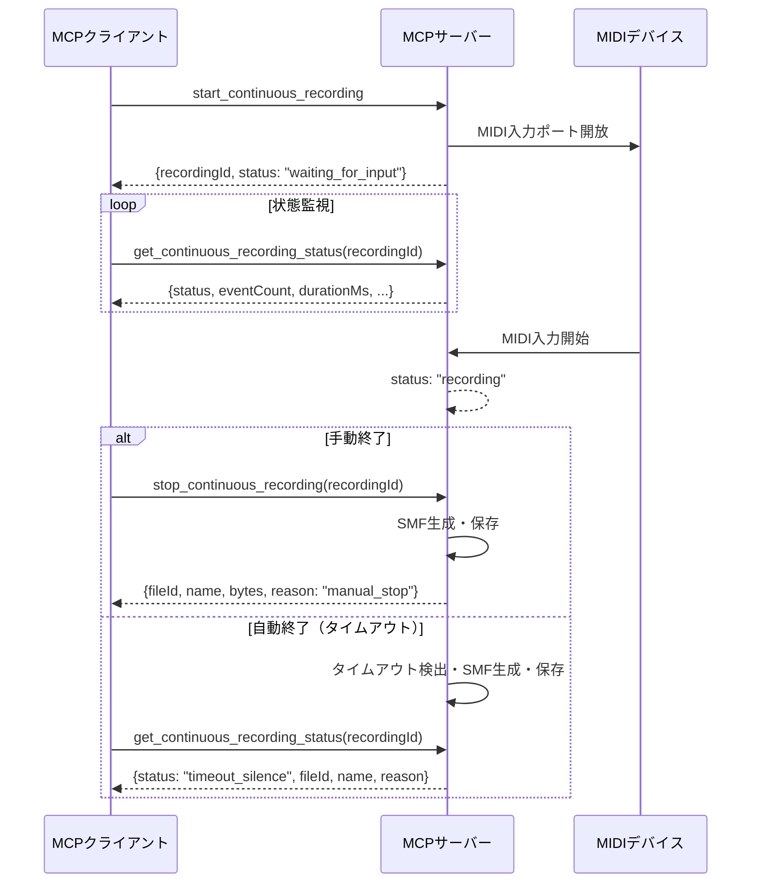
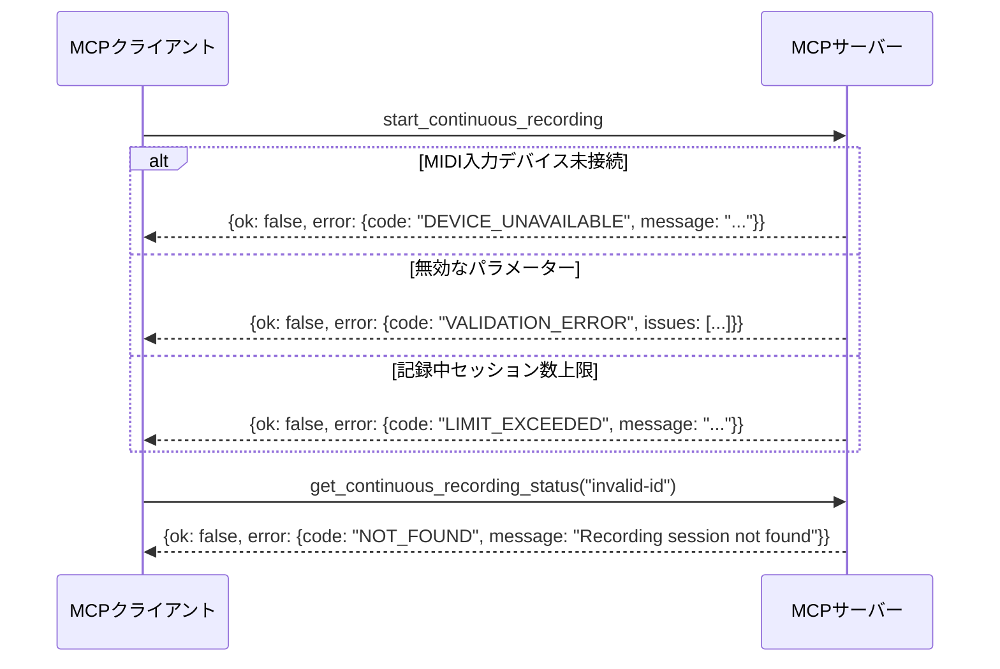

# 継続MIDI記録機能 - MCPクライアント連携インターフェース仕様

**Version**: 1.0  
**Date**: 2025-08-27  
**Status**: Draft for Review  

## 概要

継続的なMIDI演奏データのリアルタイム記録とSMFファイル保存を提供する機能のMCPクライアント連携インターフェース仕様。

## 設計原則

1. **状態追跡可能性**: 記録セッション状態をクライアントが常時監視可能
2. **柔軟な終了制御**: 自動・手動の複数終了条件をサポート
3. **堅牢性**: ネットワーク断絶・クライアント再接続時の状態復旧
4. **観測可能性**: 進捗・メトリクス・エラー情報の詳細提供

## MCPツール仕様

### 1. start_continuous_recording

**目的**: MIDI入力デバイスから継続的な演奏記録を開始

#### 入力スキーマ
```json
{
  "type": "object",
  "properties": {
    "portName": {
      "type": "string", 
      "description": "MIDI入力ポート名（省略時は利用可能な最初のポート）"
    },
    "ppq": {
      "type": "number",
      "default": 480,
      "minimum": 96,
      "maximum": 1920,
      "description": "タイミング解像度（ticks per quarter note）"
    },
    "maxDurationMs": {
      "type": "number",
      "default": 300000,
      "minimum": 10000,
      "maximum": 3600000,
      "description": "記録全体の最大継続時間（ミリ秒）"
    },
    "idleTimeoutMs": {
      "type": "number",
      "default": 30000,
      "minimum": 5000,
      "maximum": 120000,
      "description": "記録開始から最初の入力まで待機するタイムアウト（ミリ秒）"
    },
    "silenceTimeoutMs": {
      "type": "number",
      "default": 10000,
      "minimum": 2000,
      "maximum": 60000,
      "description": "最後の入力から無音継続時の自動終了タイムアウト（ミリ秒）"
    },
    "channelFilter": {
      "type": "array",
      "items": {"type": "number", "minimum": 1, "maximum": 16},
      "description": "記録対象MIDIチャンネル（省略時は全チャンネル）"
    },
    "eventTypeFilter": {
      "type": "array", 
      "items": {"type": "string", "enum": ["note", "cc", "pitchBend", "program"]},
      "default": ["note", "cc", "pitchBend", "program"],
      "description": "記録対象イベントタイプ"
    }
  },
  "required": []
}
```

#### 出力形式
```json
{
  "ok": true,
  "recordingId": "rec_20250827_143052_a1b2c3",
  "portName": "IAC Driver Bus 1",
  "ppq": 480,
  "maxDurationMs": 300000,
  "idleTimeoutMs": 30000,
  "silenceTimeoutMs": 10000,
  "channelFilter": [1, 2, 3, 4],
  "eventTypeFilter": ["note", "cc", "pitchBend", "program"],
  "startedAt": "2025-08-27T14:30:52.123Z",
  "status": "waiting_for_input"
}
```

### 2. get_continuous_recording_status

**目的**: 記録セッションの現在状態・進捗・メトリクス取得

#### 入力スキーマ
```json
{
  "type": "object",
  "properties": {
    "recordingId": {"type": "string", "required": true}
  },
  "required": ["recordingId"]
}
```

#### 出力形式
```json
{
  "ok": true,
  "recordingId": "rec_20250827_143052_a1b2c3",
  "status": "recording|waiting_for_input|completed|timeout_idle|timeout_silence|timeout_max_duration|stopped_manually|error",
  "startedAt": "2025-08-27T14:30:52.123Z",
  "firstInputAt": "2025-08-27T14:31:05.456Z",
  "lastInputAt": "2025-08-27T14:33:12.789Z",
  "currentDurationMs": 140666,
  "eventCount": 245,
  "eventBreakdown": {
    "note": 180,
    "cc": 45,
    "pitchBend": 15,
    "program": 5
  },
  "channelActivity": {
    "1": 120,
    "2": 85,
    "10": 40
  },
  "timeUntilTimeout": 159334,
  "reason": "manual_stop|idle_timeout|silence_timeout|max_duration|error",
  "estimatedFileSizeBytes": 2048,
  "portName": "IAC Driver Bus 1"
}
```

### 3. stop_continuous_recording

**目的**: 記録セッション手動終了・SMFファイル保存・fileId発行

#### 入力スキーマ
```json
{
  "type": "object", 
  "properties": {
    "recordingId": {"type": "string", "required": true},
    "name": {
      "type": "string",
      "description": "保存ファイル名（省略時は自動生成：recording-YYYY-MM-DD-HHmmss.mid）"
    },
    "overwrite": {"type": "boolean", "default": false}
  },
  "required": ["recordingId"]
}
```

#### 出力形式
```json
{
  "ok": true,
  "recordingId": "rec_20250827_143052_a1b2c3",
  "fileId": "f_rec_20250827_143052_a1b2c3_final",
  "name": "piano-session-2025-08-27.mid",
  "path": "data/midi/piano-session-2025-08-27.mid",
  "bytes": 2048,
  "durationMs": 140666,
  "eventCount": 245,
  "ppq": 480,
  "trackCount": 1,
  "reason": "manual_stop",
  "recordingStartedAt": "2025-08-27T14:30:52.123Z",
  "recordingEndedAt": "2025-08-27T14:33:12.789Z",
  "savedAt": "2025-08-27T14:33:15.100Z"
}
```

### 4. list_continuous_recordings

**目的**: 進行中・完了済み記録セッション一覧取得（デバッグ・監視用）

#### 入力スキーマ
```json
{
  "type": "object",
  "properties": {
    "status": {
      "type": "string",
      "enum": ["active", "completed", "all"],
      "default": "active"
    },
    "limit": {"type": "number", "default": 10, "maximum": 50}
  }
}
```

#### 出力形式
```json
{
  "ok": true,
  "recordings": [
    {
      "recordingId": "rec_20250827_143052_a1b2c3",
      "status": "recording",
      "startedAt": "2025-08-27T14:30:52.123Z",
      "durationMs": 140666,
      "eventCount": 245,
      "portName": "IAC Driver Bus 1",
      "fileId": null
    },
    {
      "recordingId": "rec_20250827_142012_d4e5f6",
      "status": "completed",
      "startedAt": "2025-08-27T14:20:12.456Z", 
      "endedAt": "2025-08-27T14:25:30.789Z",
      "durationMs": 318333,
      "eventCount": 512,
      "reason": "silence_timeout",
      "fileId": "f_rec_20250827_142012_d4e5f6_auto",
      "name": "recording-2025-08-27-142012.mid"
    }
  ],
  "total": 2,
  "activeCount": 1,
  "completedCount": 1
}
```

## クライアント操作フロー

### 基本的な記録フロー



### エラー処理フロー



## 状態遷移図

```
[開始] → waiting_for_input → recording → [終了状態]
                ↓                ↓
           timeout_idle    → [timeout_silence/timeout_max_duration/stopped_manually]
```

**状態定義**:
- `waiting_for_input`: 最初のMIDI入力待機中
- `recording`: 継続記録中
- `completed`: 正常終了（silence_timeout）
- `timeout_idle`: 初期入力タイムアウト
- `timeout_silence`: 無音タイムアウト
- `timeout_max_duration`: 最大時間タイムアウト
- `stopped_manually`: 手動停止
- `error`: エラー状態

## エラーコード体系

| コード | 説明 | 対処法 |
|--------|------|--------|
| `DEVICE_UNAVAILABLE` | MIDI入力デバイス利用不可 | デバイス接続確認・list_input_devices実行 |
| `NOT_FOUND` | 記録セッションID不正 | 有効なrecordingIdを指定 |
| `VALIDATION_ERROR` | パラメーター検証失敗 | パラメーター値域・型を修正 |
| `LIMIT_EXCEEDED` | セッション数・サイズ上限 | 既存セッション終了・パラメーター調整 |
| `INTERNAL_ERROR` | 内部エラー | サーバーログ確認・再試行 |

## クライアント実装ガイドライン

### 1. 状態監視推奨パターン
```javascript
// 定期ポーリング（1-5秒間隔推奨）
const monitorRecording = async (recordingId) => {
  const interval = setInterval(async () => {
    const status = await mcpCall('get_continuous_recording_status', {recordingId});
    
    if (['completed', 'timeout_silence', 'timeout_max_duration', 'stopped_manually', 'error'].includes(status.status)) {
      clearInterval(interval);
      handleRecordingEnd(status);
    } else {
      updateUI(status); // 進捗表示更新
    }
  }, 2000);
};
```

### 2. エラーハンドリング推奨パターン
```javascript
const startRecording = async (params) => {
  try {
    const result = await mcpCall('start_continuous_recording', params);
    if (!result.ok) {
      switch (result.error.code) {
        case 'DEVICE_UNAVAILABLE':
          await suggestDeviceSetup();
          break;
        case 'VALIDATION_ERROR':
          showParameterErrors(result.error.issues);
          break;
        // ... 他のエラーハンドリング
      }
      return;
    }
    
    monitorRecording(result.recordingId);
  } catch (error) {
    handleNetworkError(error);
  }
};
```

### 3. ユーザー体験推奨フロー
1. **記録開始前**: デバイス確認（`list_input_devices`）
2. **記録中**: リアルタイム進捗表示（eventCount, durationMs）
3. **記録完了後**: ファイル情報表示・再生オプション提供
4. **エラー時**: 具体的な対処法をユーザーに提示

## パフォーマンス・制約

- **同時記録セッション数**: 最大3セッション
- **メモリ使用量**: セッションあたり最大10MB
- **イベント数上限**: 1セッションあたり100,000イベント
- **ファイルサイズ上限**: 50MB
- **状態監視頻度**: 1秒に1回以上の高頻度ポーリング非推奨

## セキュリティ・プライバシー考慮

- **recordingId**: 推測困難なUUID形式
- **ファイルアクセス**: 同一プロセス内のセッションのみアクセス可能
- **自動削除**: 完了から24時間後に未保存セッションを自動削除
- **ログ出力**: MIDI演奏内容はログ出力しない

---

**この仕様書は Draft 段階です。レビュー・フィードバックをお待ちしています。**