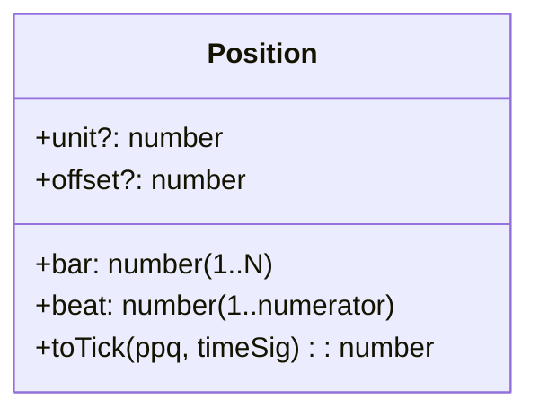
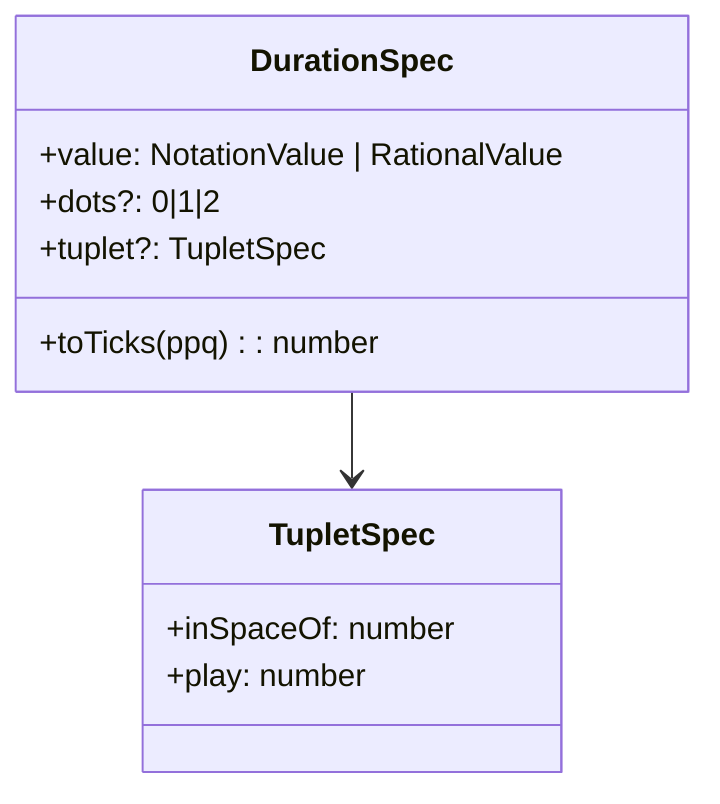
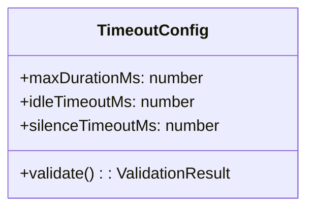
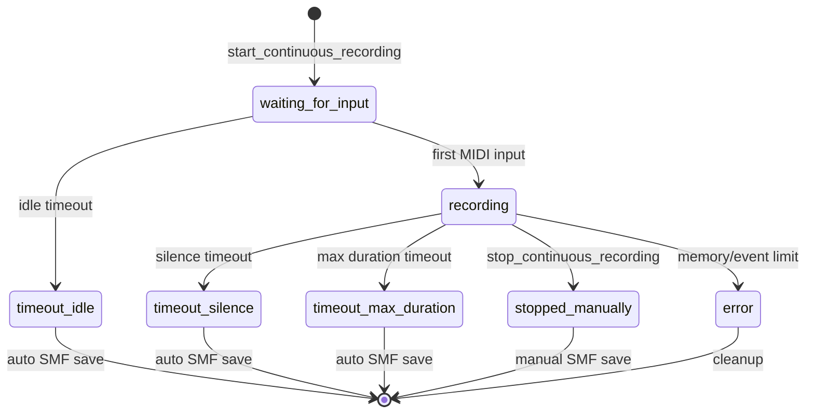
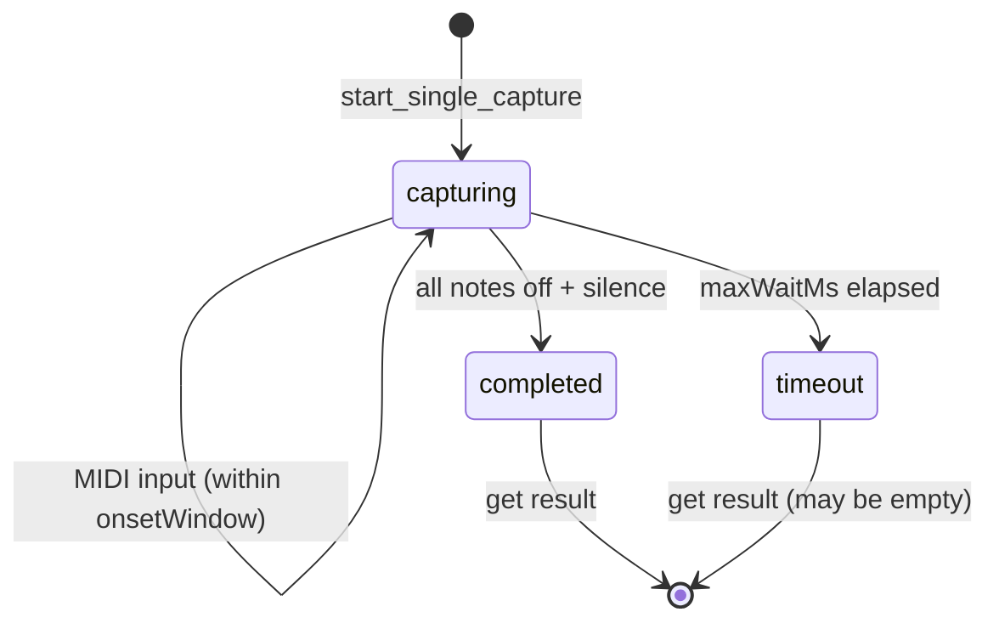
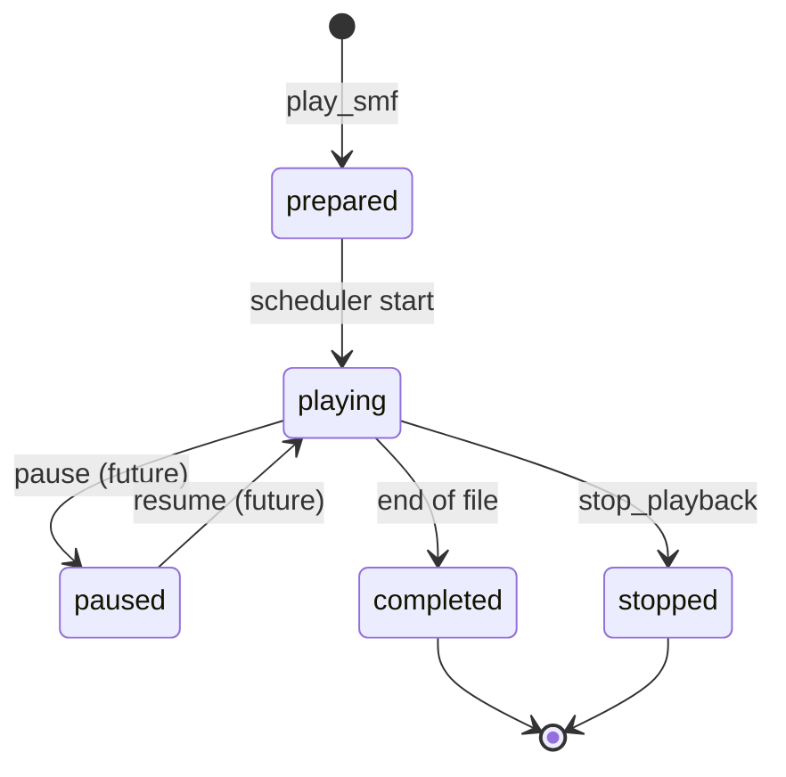

# MCP MIDI TOOL ドメインモデル仕様

Version: 1.0  
Date: 2025-08-28  
Status: Production Ready  

## 概要

MCP MIDI TOOLは非AI・決定論的なMCPスタンドアロンサーバーとして、MIDIファイルの管理・変換・再生・記録機能を提供します。JSONファースト設計により、AIとの連携に最適化された構造化MIDI処理システムです。

## ドメインモデル

```mermaid
graph TB
    %% Core Domain
    subgraph "Core MIDI Domain"
        MidiFile["MIDI File<br/>- fileId: string<br/>- name: string<br/>- bytes: number<br/>- createdAt: ISO8601"]
        
        JsonMidi["JSON MIDI v1<br/>- ppq: number<br/>- tracks: Track array<br/>- meta: MetaEvents"]
        
        ScoreDSL["Score DSL v1<br/>- ppq: number<br/>- meta: ScoreMeta<br/>- tracks: ScoreTrack array"]
        
        SMFBinary["SMF Binary<br/>- Standard MIDI File<br/>- Bytes representation"]
    end
    
    %% Storage & Manifest
    subgraph "Storage Domain"
        Manifest["Manifest<br/>- items: MidiItem array"]
        Storage["Storage Layer<br/>- baseDir: string<br/>- dataDir: string<br/>- manifestPath: string"]
        
        MidiItem["MIDI Item<br/>- id: string<br/>- name: string<br/>- path: string<br/>- bytes: number<br/>- createdAt: ISO8601"]
    end
    
    %% Playback Domain
    subgraph "Playback Domain"
        PlaybackSession["Playback Session<br/>- playbackId: string<br/>- fileId: string<br/>- status: PlaybackStatus<br/>- startedAt: timestamp<br/>- scheduledEvents: MidiEvent array"]
        
        MidiScheduler["MIDI Scheduler<br/>- lookaheadMs: number<br/>- tickMs: number<br/>- cursor: number<br/>- noteOffQueue: Map"]
        
        MidiOutput["MIDI Output<br/>- portName: string<br/>- device: MidiDevice"]
    end
    
    %% Recording Domain
    subgraph "Recording Domain"
        ContinuousSession["Continuous Recording Session<br/>- id: string<br/>- status: RecordingStatus<br/>- ppq: number<br/>- events: MidiEvent array<br/>- timeouts: TimeoutConfig"]
        
        SingleCapture["Single Capture Session<br/>- id: string<br/>- onsetWindowMs: number<br/>- notes: Map of number to NoteInfo<br/>- done: boolean"]
        
        MidiInput["MIDI Input<br/>- portName: string<br/>- device: MidiDevice<br/>- handlers: EventHandler array"]
    end
    
    %% Event Processing
    subgraph "Event Processing Domain"
        MidiEvent["MIDI Event<br/>- tick: number<br/>- type: EventType<br/>- channel: number<br/>- data: EventData"]
        
        EventProcessor["Event Processor<br/>- filters: EventFilter array<br/>- transformers: EventTransformer array"]
        
        TimeManager["Time Manager<br/>- ppq: number<br/>- bpm: number<br/>- tickToMs(): number<br/>- msToTick(): number"]
    end
    
    %% Conversion Services
    subgraph "Conversion Domain"
        JsonToSmfService["JSON to SMF Service<br/>- encode(json): SMFBinary<br/>- validate(json): ValidationResult"]
        
        SmfToJsonService["SMF to JSON Service<br/>- decode(smf): JsonMidi<br/>- extractMeta(): MetaInfo"]
        
        ScoreCompiler["Score DSL Compiler<br/>- compileToJsonMidi(): JsonMidi<br/>- validateScore(): ValidationResult<br/>- autoCcPresets: PresetProcessor array"]
    end
    
    %% Device Management
    subgraph "Device Domain"
        DeviceManager["Device Manager<br/>- listInputDevices(): Device array<br/>- listOutputDevices(): Device array<br/>- getDevice(name): Device"]
        
        MidiDevice["MIDI Device<br/>- index: number<br/>- name: string<br/>- type: DeviceType<br/>- available: boolean"]
    end
    
    %% Relationships
    MidiFile -.-> JsonMidi : converts to
    JsonMidi -.-> SMFBinary : compiles to
    ScoreDSL -.-> JsonMidi : compiles to
    
    Storage --> Manifest : manages
    Manifest --> MidiItem : contains
    MidiItem --> MidiFile : references
    
    PlaybackSession --> MidiScheduler : uses
    MidiScheduler --> MidiOutput : sends to
    PlaybackSession --> MidiFile : plays
    
    ContinuousSession --> MidiInput : receives from
    SingleCapture --> MidiInput : receives from
    ContinuousSession --> MidiEvent : stores
    
    EventProcessor --> MidiEvent : processes
    TimeManager --> MidiEvent : timestamps
    
    JsonToSmfService --> JsonMidi : consumes
    SmfToJsonService --> SMFBinary : consumes
    ScoreCompiler --> ScoreDSL : compiles
    
    DeviceManager --> MidiDevice : manages
    MidiInput --> MidiDevice : uses
    MidiOutput --> MidiDevice : uses
```

## エンティティ詳細

### 1. Core Entities

#### MidiFile
- **目的**: システム内でのMIDIファイル表現
- **ライフサイクル**: store_midi → get_midi → export_midi
- **永続化**: manifest.json + data/midi/ ディレクトリ

#### JsonMidi
- **目的**: 構造化されたMIDI表現（AIとの連携最適化）
- **特徴**: tick/ppqベース、検証可能スキーマ
- **変換**: SMF ⇔ JSON 双方向対応

#### ScoreDSL
- **目的**: 音楽家向けの記譜的表現
- **特徴**: 小節/拍/音価/アーティキュレーション
- **コンパイル**: Score DSL → JSON MIDI → SMF

### 2. Session Entities

#### ContinuousRecordingSession
- **目的**: 長時間MIDI演奏の継続記録
- **状態遷移**: waiting_for_input → recording → completed/timeout/stopped
- **制約**: 最大3セッション同時、100K イベント上限、10MB メモリ制限

#### SingleCaptureSession  
- **目的**: 単発和音/単音のリアルタイムキャプチャ
- **特徴**: onsetWindow内の音符を和音として処理
- **完了条件**: 全ノートOff + silence経過 or maxWaitMs到達

#### PlaybackSession
- **目的**: SMFファイルのリアルタイム再生
- **スケジューラ**: ルックアヘッド型、未消音ノート管理
- **制御**: start/stop/pause, 範囲再生対応

### 3. Value Objects

#### Position (Score DSL)


#### DurationSpec (Score DSL)


#### TimeoutConfig


### 4. Services & Domain Logic

#### EventProcessor
- **フィルタリング**: Channel (1-16), EventType (note/cc/pitchBend/program)
- **変換**: tick基準時間計算、チャンネルマッピング (外部1-16 ↔ 内部0-15)
- **検証**: MIDI仕様準拠チェック

#### ScoreCompiler
- **位置計算**: Position → tick変換（小節/拍/unit/offset）
- **音価計算**: DurationSpec → ticks（付点・連符対応）  
- **自動CC付与**: autoCcPresets (sustain_from_slur, crescendo_to_expression)

#### MidiScheduler
- **再生制御**: ルックアヘッドスケジューリング
- **ノート管理**: 未消音ノートの追跡・強制消音
- **タイミング**: 高精度tick計算とMIDI送出

## 状態遷移図

### Continuous Recording Session


### Single Capture Session


### Playback Session


## アーキテクチャパターン

### 1. Domain-Driven Design
- **エンティティ**: MidiFile, Session類
- **値オブジェクト**: Position, DurationSpec, TimeConfig
- **ドメインサービス**: Compiler, Scheduler, EventProcessor
- **リポジトリ**: Storage, Manifest

### 2. Event Sourcing (部分適用)
- **MIDIイベントストリーム**: 継続記録でのイベント蓄積
- **再生**: イベント列のリアルタイム送出
- **変換**: イベント列の形式変換 (JSON ↔ SMF ↔ Score DSL)

### 3. Strategy Pattern
- **入力**: デバイス入力 vs 擬似入力 (Single Capture)
- **出力**: 実デバイス出力 vs dryRun
- **変換**: JSON MIDI vs Score DSL → SMF

### 4. Command Pattern  
- **MCPツール**: 各ツール呼び出しをコマンドとして処理
- **バリデーション**: 入力検証の統一化
- **エラーハンドリング**: 構造化エラー分類

## 制約・不変条件

### ビジネスルール
1. **同時記録制限**: 最大3つのContinuous Recording Session
2. **メモリ制限**: セッションあたり100K イベント、10MB推定サイズ
3. **ファイル命名**: 重複回避、タイムスタンプベース既定命名
4. **自動削除**: 完了セッションの24時間後削除

### 技術制約
1. **チャンネル表記**: 外部1-16 ↔ 内部0-15の一貫したマッピング
2. **tick精度**: JavaScript数値精度内でのtick計算
3. **デバイス依存**: node-midi利用可能環境での動作保証
4. **プロセス分離**: manifest.{pid}.json によるプロセス間分離

## 拡張ポイント

### 近期拡張 (R2-R4)
- **transform_midi**: transpose, quantize, tempo変更, humanize
- **クロスプラットフォーム**: Windows/Linux対応強化  
- **CI/CD**: 各OS自動ビルド・テスト

### 中期拡張 (将来)
- **Score DSL v2**: 複雑な音価、调性転調、デコレーション
- **プラグインシステム**: カスタムCC生成、音源固有キースイッチ
- **リアルタイム協調**: 複数クライアント同時記録・編集
- **AI連携強化**: 生成音楽の構造化検証・音楽理論チェック

---

このドメインモデルは、MCP MIDI TOOLの核となる概念とその関係性を整理し、システム全体の理解と将来拡張の指針を提供します。